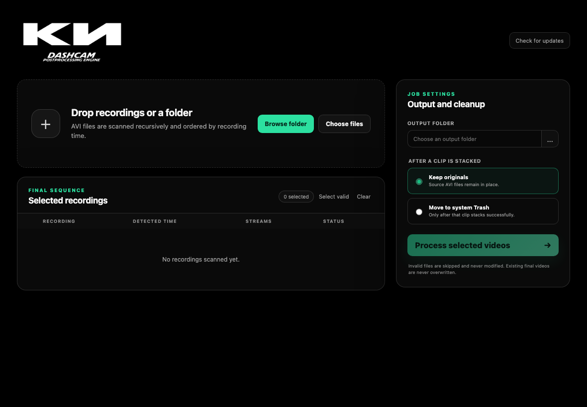

# Kia Dashcam Processor

A self-contained desktop application and command-line tool for converting a folder
of two-channel Kia dashcam AVI recordings into one ordered, vertically stacked,
H.265 MP4. It runs on Windows, macOS, and Linux without requiring the user to
install PowerShell, Python, FFmpeg, FFprobe, or HandBrake.



The cross-platform implementation keeps the original four-stage media workflow and
every encoding parameter from [`dashcam.ps1`](dashcam.ps1). The PowerShell script is
retained unchanged as the legacy reference.

## Highlights

- Native Tauri desktop interface with file/folder drag and drop and native browsers.
- Standalone CLI for repeatable and automated processing.
- One shared Rust core so GUI and CLI discovery, ordering, commands, validation,
  resume behavior, cleanup, and output naming cannot drift apart.
- Recursive, case-insensitive AVI discovery with visible validation results.
- Deterministic recording-time ordering with metadata and filename fallbacks.
- Resumable output-local job manifests and safe cancellation.
- Existing final videos are never overwritten.
- Cleanup is limited to keeping sources or moving successful sources to the
  operating-system Trash. Permanent source deletion is never used.
- FFmpeg, FFprobe, and HandBrakeCLI are included inside every application/CLI
  package and are never located through the system `PATH`.
- Checksum, architecture, feature, and redistribution gates for packaged media
  executables.
- Signed GUI and CLI update design with tampered-update rejection.
- Release automation for Windows x64, macOS Intel, macOS Apple Silicon, and Linux
  x64.

## Supported packages

| Platform | GUI package | Standalone CLI |
| --- | --- | --- |
| Windows x64 | NSIS installer | ZIP archive |
| macOS Apple Silicon | DMG | TAR.GZ archive |
| macOS Intel | DMG | TAR.GZ archive |
| Linux x64 | AppImage | TAR.GZ archive |

Every package contains its matching media executables. Cross-architecture bundles
are built on native GitHub Actions runners so the wrong binary cannot be silently
inserted into a release.

## Desktop workflow

1. Open **Kia Dashcam Processor**.
2. Drop one or more AVI files/folders into the drop area, or select **Browse folder**.
3. Review the ordered checklist. It shows each path, detected recording time,
   timestamp source, stream counts, validity, and skip reason.
4. Include or exclude any valid clips.
5. Select an output folder.
6. Choose **Keep originals** or **Move to system Trash**.
7. Confirm the selected clips, destination, and cleanup policy.
8. Follow the current stage, file, task progress, elapsed time, ETA, and logs.

Cancellation stops the active media process and leaves a resumable workspace. The
next matching run can continue completed stages instead of starting over.

## CLI usage

```text
kia-dashcam-cli process <folder>
    [--output-dir <folder>]
    [--cleanup trash|keep]
    [--restart]
    [--no-update-check]
```

Process a folder and keep the source recordings:

```bash
kia-dashcam-cli process "/path/to/dashcam" \
  --output-dir "/path/to/results" \
  --cleanup keep
```

The CLI scans recursively, defaults to `--cleanup trash`, and resumes a matching
interrupted job automatically. `--restart` removes only the matching app-created
workspace and starts that job again; it never deletes source recordings.

Exit codes:

| Code | Meaning |
| ---: | --- |
| `0` | Processing completed successfully. |
| `2` | Invalid invocation, no usable inputs, or incompatible saved state. |
| `3` | Media command, generated-media validation, or cancellation failure. |
| `4` | Internal tool, output, filesystem, or manifest failure. |

Use `--no-update-check` in scheduled/non-networked environments. A failed update
check is only a warning and does not prevent local processing.

## Input discovery and validation

Folders are scanned recursively without following directory symlinks. File
extensions are matched case-insensitively, so `.avi`, `.AVI`, and mixed-case forms
are accepted. Names containing these generated fragments are excluded:

- `track1`
- `track2`
- `stacked`
- `final_stitched`

Each remaining file is inspected with the bundled FFprobe. A valid input must have:

- at least two video streams (`0:v:0` and `0:v:1`), and
- a first audio stream addressable as `0:a:0`.

Invalid candidates stay disabled and are never modified. The CLI prints their skip
reasons; the GUI displays those reasons in the checklist.

## Recording order

The processor selects the first available time source in this order:

1. Container `creation_time` metadata.
2. First video-stream `creation_time` metadata.
3. A recognizable date/time in the filename, including compact timestamps and
   separated `YYYY-MM-DD HH-MM-SS` variants.
4. Filesystem modification time.
5. Natural, case-insensitive relative-path order for ties.

Natural ordering keeps names such as `clip2.avi` before `clip10.avi`.

## Preserved media pipeline

The implementation intentionally preserves the legacy command behavior:

| Stage | Operation | Required parameters |
| --- | --- | --- |
| Split | Copy the two video channels into separate AVIs, each with the first audio stream. | `-fflags +genpts`, `-map 0:v:0`, `-map 0:v:1`, `-map 0:a:0`, stream copy |
| Stack | Scale both channels and stack them vertically. | width `1920`, `yuv420p`, `vstack=inputs=2`, H.264 `preset=fast`, `crf=23`, AAC `192k` |
| Stitch | Join ordered stacked clips without re-encoding. | concat demuxer, `safe=0`, stream copy |
| Compress | Produce the distributable MP4. | HandBrake x265, quality `22`, fast preset, crop `0:0:0:0`, audio copy |

FFprobe validates every generated file before its manifest stage advances. Runtime
stream incompatibilities stop with a clear error and preserve temporary state; the
processor does not silently substitute a different codec or concatenate strategy.

Final output names are versioned without overwriting:

```text
final_stitched_sequence_compressed.mp4
final_stitched_sequence_compressed_2.mp4
final_stitched_sequence_compressed_3.mp4
```

## Resume and cleanup safety

Active state lives under:

```text
<output-folder>/.kia-dashcam-work/<job-fingerprint>/
```

The manifest records sources, completed split/stack stages, stitching/compression
state, cleanup policy, and reserved final output path. If a stage fails or the user
cancels, validated intermediates remain available for resume. A successful job
removes its fingerprinted workspace.

With Trash cleanup, a source AVI is moved only after its stacked output validates.
If the operating-system Trash operation fails, the original remains in place and a
warning is emitted. Intermediate files created by this application are removed
directly when they are no longer needed; source recordings are never permanently
deleted.

## Bundled media tools

Production GUI and CLI code resolves executables only from its private
`media-tools` directory beside/inside the application package. It:

- never searches the system `PATH`;
- accepts no runtime FFmpeg/FFprobe/HandBrake override;
- performs no runtime media-tool download; and
- fails clearly when the internal bundle is incomplete.

Release preparation downloads only the immutable build inputs pinned in
[`media-tools.lock.json`](media-tools.lock.json). Before packaging, the staging gate:

1. verifies each archive SHA-256;
2. confirms the staging runner matches the requested target;
3. verifies native macOS architectures with `lipo`;
4. thins universal macOS tools to the release target architecture;
5. signs every macOS media executable with hardened runtime and verifies it;
6. executes FFmpeg and FFprobe license reports;
7. rejects `--enable-nonfree` and builds marked non-redistributable;
8. requires the GPL and libx264 features used by the unchanged pipeline; and
9. confirms the pinned HandBrake version.

Local macOS staging uses a complete ad-hoc signature so local app bundles have a
valid resource seal. Tagged releases import a Developer ID Application identity
before staging, replace the nested executable signatures with that identity, and
record hashes only after thinning and signing are complete.

Licenses and corresponding source locations are documented in
[`THIRD_PARTY_NOTICES.md`](THIRD_PARTY_NOTICES.md). The media programs remain
separate command-line executables; their source is not linked into the MIT-licensed
Rust application.

## Architecture

```text
apps/dashcam-gui (TypeScript + Tauri)
             │
             ├── scan/start/cancel/update commands
             │
             ▼
crates/dashcam-core (shared Rust engine)
             ▲
             │
apps/dashcam-cli (Clap CLI + signed self-update)
             │
             ▼
internal media-tools/ (FFmpeg + FFprobe + HandBrakeCLI)
```

Shared public types include `VideoCandidate`, `JobPlan`, `CleanupPolicy`,
`JobEvent`, `JobResult`, `PendingJobInfo`, `ToolPaths`, and `CancellationToken`.

Project directories:

- `crates/dashcam-core`: discovery, ordering, manifests, processing, cleanup,
  events, validation, and cancellation.
- `apps/dashcam-cli`: command-line contract, progress reporting, exit codes, and
  signed self-update client.
- `apps/dashcam-gui`: Vite frontend, styles, Tauri backend, permissions, icons, and
  packaging configuration.
- `scripts`: pinned media staging, versioning, CLI archives, signing, HandBrake
  Linux builds, and update tamper checks.
- `.github/workflows`: continuous integration and signed tagged releases.

## Developer setup

Prerequisites:

- Current stable Rust with `rustfmt` and `clippy`.
- Node.js 22 or newer.
- Native [Tauri v2 prerequisites](https://v2.tauri.app/start/prerequisites/) for
  the host operating system.
- `unzip` on macOS/Linux; PowerShell on Windows.
- Linux-only HandBrake build dependencies listed in the release workflow.

From the repository root:

```bash
npm ci --prefix apps/dashcam-gui
npm run prepare:media --prefix apps/dashcam-gui
cargo test --workspace
cargo clippy --workspace --all-targets -- -D warnings
npm run build --prefix apps/dashcam-gui
```

Run the desktop application:

```bash
npm run tauri --prefix apps/dashcam-gui -- dev
```

Run the CLI from source by placing a development copy of the verified tools beside
the compiled executable:

```bash
mkdir -p target/debug/media-tools
cp -R apps/dashcam-gui/src-tauri/binaries/media-tools/. target/debug/media-tools/
cargo run -p kia-dashcam-cli -- \
  process "/path/to/dashcam" --cleanup keep --no-update-check
```

On Linux, compile the pinned HandBrake source before staging:

```bash
bash scripts/build-linux-handbrake.sh "$PWD/dist/HandBrakeCLI"
KIA_HANDBRAKE_PATH="$PWD/dist/HandBrakeCLI" \
  npm run prepare:media --prefix apps/dashcam-gui
```

`KIA_HANDBRAKE_PATH` is a build-time packaging input only. Installed applications
do not read it.

## Tests

```bash
cargo fmt --all -- --check
cargo clippy --workspace --all-targets -- -D warnings
cargo test --workspace
npm run build --prefix apps/dashcam-gui
```

The suite covers recursive discovery, exclusions, compact/separated timestamps,
natural path ties, output versioning, CLI parsing, internal-only tool resolution,
and exact media argument preservation. The processing regression uses synthetic
tools to exercise all four stages. Release validation additionally covers real
two-channel AVI fixtures, Unicode/spaced paths, native package smoke tests, signed
archive verification, and tampered-update rejection.

## Signed releases and updates

Pushing a semantic version tag such as `v1.2.0` runs
[the release workflow](.github/workflows/release.yml). Each target job stages its
own verified media tools, builds and signs the application and CLI, smoke-tests the
archive, generates updater metadata, and uploads to a draft GitHub Release. The
release is published only after every platform succeeds.

Local builds intentionally omit updater initialization and do not need production
keys. Tagged release builds generate an ignored Tauri configuration containing the
repository-derived endpoint and public updater key. The private keys exist only in
protected CI secrets.

Required GitHub Actions secrets:

- `TAURI_SIGNING_PRIVATE_KEY`
- `TAURI_SIGNING_PRIVATE_KEY_PASSWORD`
- `TAURI_SIGNING_PUBLIC_KEY`
- `CLI_UPDATE_PRIVATE_KEY_BASE64`
- `APPLE_CERTIFICATE`
- `APPLE_CERTIFICATE_PASSWORD`
- `APPLE_ID`
- `APPLE_PASSWORD`
- `APPLE_TEAM_ID`
- `KEYCHAIN_PASSWORD`
- `WINDOWS_CERTIFICATE_BASE64`
- `WINDOWS_CERTIFICATE_PASSWORD`

Required protected Actions variable:

- `KIA_CLI_UPDATE_PUBLIC_KEY_HEX`: 32-byte zipsign public key encoded as 64 hex
  characters.

Generate the CLI update keypair with:

```bash
cargo install zipsign --version 0.2.1 --locked
zipsign gen-key cli-update-private.key cli-update-public.key
```

The GUI checks for signed updates on launch, shows release notes, asks before
installation/restart, and defers updates while processing. The CLI prompts only in
interactive use; noninteractive use prints a notice. Missing/invalid signatures are
rejected, and update network failures never block local video processing.

The macOS release gate rejects an artifact unless the main executable and all three
media tools are architecture-specific, signed by the same Developer ID team, covered
by a strict deep bundle signature, notarized, stapled, accepted by Gatekeeper, and
identical to their post-signing manifest hashes.

## Troubleshooting

### The macOS app opens slowly

Do not distribute an app copied from an unsigned build directory. Use the tagged
release DMG, drag the app into `/Applications`, and verify it with:

```bash
bash scripts/verify-macos-app.sh \
  "/Applications/Kia Dashcam Processor.app" \
  aarch64-apple-darwin
```

Use `x86_64-apple-darwin` on an Intel Mac. The verification must report a signed,
notarized application; an ad-hoc identity is intended only for local builds.

### “Required media tool not found”

The application deliberately refuses a system-installed fallback. Reinstall the
self-contained package, or rerun `prepare:media` in a development checkout and copy
the complete `media-tools` directory beside the CLI.

### A file is skipped

Review its displayed reason or CLI message. Common causes are fewer than two video
streams, no audio stream, an unreadable container, or a generated filename excluded
from discovery. Skipped files are untouched.

### Processing stopped midway

Keep `<output>/.kia-dashcam-work/` and rerun with the same selected inputs, output
folder, and cleanup policy. The CLI resumes automatically. Use `--restart` only when
you intentionally want to discard the matching intermediate state.

### Concatenation fails

The unchanged workflow uses concat stream copy and assumes the retained recordings
come from one compatible dashcam profile. The processor reports incompatible stream
characteristics instead of silently re-encoding with different parameters.

### Trash cleanup warns

The operating system refused the Trash operation. The original source remains in
place; fix filesystem/Trash permissions and move it manually if desired.

## Privacy and network behavior

Video discovery, metadata inspection, transcoding, manifests, and cleanup all run
locally. Source videos are never uploaded by this application. Optional update
checks contact only the repository-derived GitHub Releases endpoint and can be
disabled in the CLI with `--no-update-check`. Media tools are never fetched at
runtime.

## License

The Rust/Tauri application source is available under the [MIT License](LICENSE).
Bundled FFmpeg/FFprobe and HandBrakeCLI are redistributed under their respective GPL
terms; see [`THIRD_PARTY_NOTICES.md`](THIRD_PARTY_NOTICES.md) and
[`media-tools.lock.json`](media-tools.lock.json).
